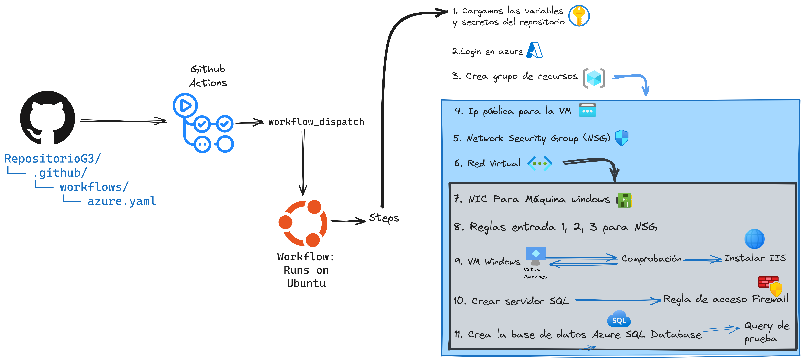

# Microsoft action workflow

## Github action workflow

### Este script Bash automatiza la creación de recursos en Azure para configurar una infraestructura.

> [!NOTE]  
> A continuación, se detallan las acciones principales que realiza:

1. **Creación de Grupo de Recursos**: Crea un grupo de recursos en Azure especificado por el usuario.
2. **Creación de Red Virtual y Subred**: Configura una red virtual y una subred dentro del grupo de recursos.
3. **Creación de IP Pública**: Genera una dirección IP pública estática para la máquina virtual.
4. **Creación de Network Security Group (NSG)**: Establece un NSG para controlar el tráfico de red.
5. **Configuración de Reglas NSG**: Define reglas de seguridad para permitir el tráfico RDP y HTTP entrante.
6. **Verificación de IP Pública**: Espera hasta que la dirección IP pública esté disponible.
7. **Creación de Tarjeta de Interfaz de Red (NIC)**: Crea una NIC asociada a la máquina virtual.
8. **Creación de Máquina Virtual**: Despliega una máquina virtual Windows Server 2019 en Azure.
9. **Instalación de Servidor Web**: Instala y configura un servidor web en la máquina virtual.
10. **Apertura del Puerto 80**: Permite el tráfico HTTP al abrir el puerto 80 en la máquina virtual.
11. **Verificación del Estado del Servidor Web**: Verifica que el servidor web esté funcionando correctamente mediante una solicitud HTTP.
12. **Creación de Servidor SQL**: Crea un servidor SQL en Azure.
13. **Configuración de Reglas de Firewall**: Establece reglas de firewall para permitir el acceso al servidor SQL desde direcciones IP específicas.
14. **Creación de Base de Datos**: Crea una base de datos de ejemplo en el servidor SQL.
15. **Asignación de Rol a Usuario**: Asigna el rol de Contribuidor a un usuario específico para el grupo de recursos.
16. **Limpieza de Recursos**: Elimina todos los recursos creados al finalizar el script (comentado por defecto).

El script utiliza la CLI de Azure (Azure CLI) para interactuar con la plataforma Azure y ejecuta acciones secuenciales dependientes del éxito de la acción anterior. Asegúrate de tener configurada la CLI de Azure y los permisos adecuados antes de ejecutar el script.
